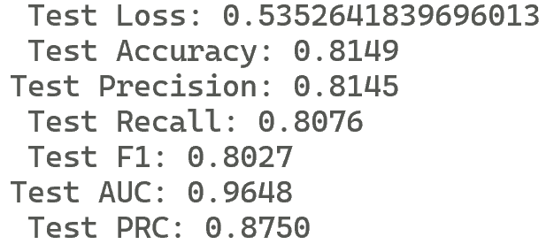

# Self-Supervised Learning for Time Series: Contrastive or Generative?

#### Authors: Ziyu Liu (ziyu.liu2@student.rmit.edu.au), Azadeh Alavi, Minyi Li, Xiang Zhang  
### [Paper Link](https://github.com/AI4TS/AI4TS.github.io/blob/main/CameraReadys%201-22%202/5%5CCameraReady%5CIJCAI23_TSworkshop_Jun29.pdf)

Self-Supervised Learning (SSL) - подход к изучению представлений на основе больших немаркированных данных. Рассматривается применение SSL для решения задачи классификации активности людей. Данные представлены временными рядами.

Self-Supervised Learning можно разделить на два основных направления: контрастивное и генеративное. В данной работе проводится сравнение методов SSL разных направлений для временных рядов. Контрастивное обучение представлено моделью SimCLR, а генеративное MAE.

Для каждого метода параметр "Pretrained" означает, что мы использовали обученный кодер
для SimCLR или MAE. Иначе веса кодера инициализируются случайно. Столбец "Ratio" в таблице результатов означает соотношение меток, т. е. долю меток, используемых на этапе тонкой настройки.

Мы оцениваем модели на базе данных HAR (Human Activity Recognition Using Smartphones).

### Инструкция по запуску

1. Установите git и docker

2. Склонируйте репозиторий

3. Скачайте данные по ссылке: https://figshare.com/ndownloader/articles/19930244/versions/1 и перенесите их по пути Datasets/HAR/

4. Выполните сборка контейнера:
- docker build -t ssl_comparison .

5. Выполните предобучение моделей
- docker run -e PRETRAIN="" -e SCRIPT_NAME=Contrastive/SimCLR/SimCLR_pretrain.py ssl_comparison

- docker run -e PRETRAIN="" -e SCRIPT_NAME=Generative/MAE/MAE_pretrain.py ssl_comparison

6. Выполните дообучение моделей (finetuning) для предтренированных моделей и нет
- docker run -e PRETRAIN=true -e SCRIPT_NAME=Contrastive/SimCLR/SimCLR_finetune_test.py ssl_comparison

- docker run -e PRETRAIN=false -e SCRIPT_NAME=Contrastive/SimCLR/SimCLR_finetune_test.py ssl_comparison

- docker run -e PRETRAIN=true -e SCRIPT_NAME=Generative/MAE/MAE_finetune_test.py ssl_comparison

- docker run -e PRETRAIN=false -e SCRIPT_NAME=Generative/MAE/MAE_finetune_test.py ssl_comparison

### Сравнение результатов авторов статьи и смок тестов

### Результаты смок тестов

